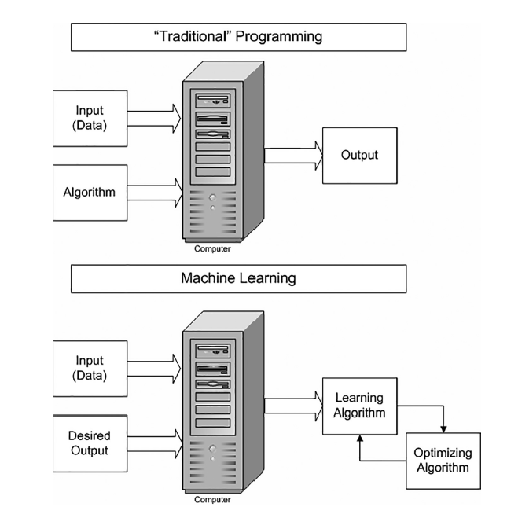
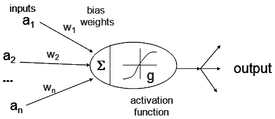

name: title
class: center, middle, reduced_opacity
background-image: url("")
background-size: cover

# Advanced Topics<br>in Predictive Modeling<br>in Clinical Research

```{r, echo=FALSE, out.width = "30%"}
knitr::include_graphics("img/Orsetto-lavatore.jpg")
```

### 20 minutes from Machine- to Deep- Learning

.large[
  Corrado Lanera | Unit of Biostatistics Epidemiology and Public Health | 2021/12/09
]


```{r setup, include=FALSE}
options(htmltools.dir.version = FALSE)
knitr::opts_chunk$set(
  fig.retina = 3,
  warning = FALSE,
  message = FALSE,
  comment = "",
  out.width = "100%"
)
```

```{css, echo=FALSE}
.left-code {
  color: #777;
  width: 38%;
  height: 92%;
  float: left;
}
.right-code {
  color: #777;
  width: 55%;
  height: 92%;
  float: right;
  padding-top: 0.5em;
}
.left-plot {
  width: 43%;
  float: left;
}
.right-plot {
  width: 60%;
  float: right;
}

```


```{r xaringan-themer, include=FALSE, warning=FALSE}
library(xaringanthemer)
red <- "#f34213"
purple <- "#3e2f5b"
orange <- "#ff8811"
green <- "#136f63"
white <- "#FFFFFF"
pastel_orange <- "#F97B64"
blu_gray <- "#1F4257"
style_duo_accent(
    colors = c(
        red = red,
        purple = purple,
        orange = orange,
        green = green,
        white = white,
        pastel_orange = pastel_orange,
        blu_gray = blu_gray
    )
)
```

```{r xaringanExtra, include=FALSE}
xaringanExtra::use_xaringan_extra(c(
  # "tileview",
  # "animate_css",
  # "tachyons",
  # "editable",
  # "panelset",
  # "webcam",
  # "clipboard",
  # "freezeframe",
  # "share_again"
))
```

---
name: whoami
class: inverse, bottom, right

```{r, echo=FALSE, out.width = "50%"}
knitr::include_graphics("img/profilo_CL.jpg")
```
# Find me at...


[`r fontawesome::fa("link")`](https://www.unipd-ubep.it/) [**www.unipd-ubep.it**](https://www.unipd-ubep.it/)

[`r fontawesome::fa("mail-bulk")`](mailto:Corrado.Lanera@ubep.unipd.it) [**Corrado.Lanera@ubep.unipd.it**](mailto:Corrado.Lanera@ubep.unipd.it)

[`r fontawesome::fa("github")`](https://github.com/corradolanera)
[`r fontawesome::fa("twitter")`](https://twitter.com/corradolanera)
[`r fontawesome::fa("telegram-plane")`](https://telegram.me/CorradoLanera)
**@CorradoLanera**

[`r fontawesome::fa("github")`](https://github.com/UBESP-DCTV)
**@UBESP-DCTV**


---
class: center, bottom, hide-count

# 
```{r, echo=FALSE, out.width = "40%"}
knitr::include_graphics(c("img/thankyou-robot.jpg"))
```


### Special thanks to professor .blu_gray[Paola Berchialla] for having provided me with much of the idea and material I have included in this presentation.


---
name: intro-what
class: inverse, middle, center

# Outline

.left[
- Overview

- Machine Learning

- Deep Learning

- Bayesian Neural Networks... (by .pink[__Danila.Azzolina__]@unife.it, Ph.D.)
]


---
name: intro-what
class: inverse, middle, center

# Overview

---

# .orange[What is Machine Learning]


Machine Learning deals with the study, the design and the development of algorithms that give computers the capability to learn without being explicitly programmed

.right[Samuel, 1959]

```{r, echo=FALSE, message=FALSE, warning=FALSE, fig.align='center', out.width="70%"}
knitr::include_graphics("img/samuel.png")
```


---

# .orange[What is Machine Learning]


A computer program is said to learn from .orange[experience] with respect to some class of .orange[tasks] and .orange[performance measure], if its .green[performance] at the given .green[task] improves with .green[experience].

One useful perspective on machine learning is that it involves searching a very large space of possible hypotheses to .orange[determine one that best fits the observed data and any prior knowledge held by the learner]

.right[_Machine Learning_ - Mitchell, 1997]


---

# .orange[How do Machines learn?]


A learning algorithm is an algorithm that is able to .orange[learn from data].


Machine learning is concerned with finding functions 

$$Y = f(X) + \epsilon$$ 

that best **predict** outputs (responses), given data inputs (predictors)


```{r, echo=FALSE, message=FALSE, warning=FALSE, fig.align='center', out.width="60%"}
knitr::include_graphics("img/ml-process.png")
```

.orange[_Learners_] are algorithms that improve their skills by learning from old/known .orange[__(training)__] data.


> A .orange[_learner_] uses data and experience to perform better over time


---


# .orange[How do Machines learn?]


.left-code[
In machine learning, we provide the .orange[input] (data), the desired result and out comes the .orange[learning] algorithm 

<br>
<br>

Mathematically, Machine Learning problems are simply .orange[*optimisation*] problems
]


.right-plot[
```{r, echo=FALSE, message=FALSE, warning=FALSE, fig.align='center', out.width="90%"}

```
]


---
name: intro-what
class: inverse, middle, center

# Machine Learning


---
# .orange[Learning problem] 

A computer program is said to **learn**

 - from .orange[experience] **E**

 - with respect to some .orange[task] **T**

 - and some .orange[performance measure] **P**


if its performance on **T**, as measured by **E**, improves with experience **E**.

---
# .orange[Task]

A __task__ is something the ML must carry out

  - the process of **learning itself is not the task**

  - _Learning_ is the mean of attaining the ability to perform the task

# .orange[Experience]

A __task__ is defined in terms of _how the ML should process a collection of Examples_. I.e., how the machine _processes_/_elaborates_ the __experience__

  - a training dataset _is_ the main (direct) __experience__

  - a validation dataset _is_ (indirect) __experience__! (subdole point...)

  - a test dataset _is not_ __experience__ 
  
  
---
## .orange[Performance]

A __performance__ is a quantitative measure for assessing the ability of ML
  - performance is measured on the task being carried out

Usually __performance__ is measured in terms of:
  - .orange[_accuracy_]: proportion of examples for which the model produces the correct output.
  - .orange[_error rate_]: proportion of examples for which the model produces the incorrect output.

--

## .orange[.center[**WARNING**<br>Unbalanced outcomes require balanced metrics!]]


---
# .orange[Supervised learning]

> The algorithm experiences a dataset containing features, and each example is associated with _**a label**_ (target).

The learning algorithm is provided with a set of inputs along with the corresponding .orange[correct] outputs.

Learning involves the algorithm comparing its current actual inferred output with the correct one, so that to learn from its .orange[errors] (to minimize it).


Input data is .orange[labeled] based on existing knowledge

The model continues to train until it achieves a desired .orange[level of performance] on the training dataset.


---
# .orange[Unsupervised learning]

> The input data is _not labeled_ and thus the ML is not told the right answer (there are not right answers!)

It is not trained on pairs consisting of an input ( $X$ ) and the desired output ( $y$ ). 

The ML is given the input data and is left to find interesting .orange[patterns], .orange[regularities], or .orange[clusterings] among them.


---
# .orange[Classification]

.left-code[
__Feature space__
  
  - data: points in $\mathbb{R}^d$
  
  - dimensions:  scalar measurements

<br>

__Classifier functions (_classifiers_)__
  
  - a classifier for $K$ classes is a function

$$
f:\mathbb{R}^d \to \{1, \ldots, K \}   
$$
  - classifiers carve up the space into regions
]

.right-plot[

```{r, echo=FALSE, message=FALSE, warning=FALSE, fig.align="center", out.width="100%"}
knitr::include_graphics("img/classification_3.png")
```

]


---

# .orange[Quantifying errors]

**Loss function** (for .orange[K] classes):

$$\rm loss: \{1, \ldots K\}\times \{1, \ldots K\} \to [0, \infty)$$

<br>

Usage:

$${\rm loss} (f(x), {\rm true\ class\ of\ }x)$$

<br>
<br>

> **IF** all mistakes are equally bad:
$$\textrm {loss}(i, j) = \begin{array}{ll}
1 & \textrm {if } i\neq j  \cr
0 & \textrm {if } i= j  \cr
\end{array}$$


---
# .orange[Ensemble classifiers]


__Weak classifier__

  Consider two classes of equal size: assign class by coin flip: 50% expected error

  > weak classifier: .orange[error rate slightly below 50%]

If weak classifiers are applicable to $k>2$ classes, so it is ensemble.


__Ensemble Classifier__
  - trains .orange[many _weak_] classifiers
  - .orange[combines results] by majority vote

__Error rate__
  - proportion of miclassified points
  - expected number of error


<br>

**Important examples: .orange[Random Forests]**


---

# .orange[Weak learner: tree classifier]


.pull-left[
```{r, echo=FALSE, message=FALSE, warning=FALSE, fig.align="center", out.width="90%"}
knitr::include_graphics( "img/tree_4.png")
```
]
.pull-right[
```{r, echo=FALSE, message=FALSE, warning=FALSE, fig.align="center", out.width="90%"}
knitr::include_graphics("img/tree_5.png")
```
]


---

# .orange[Random forest]

.orange[Tree training]: Input $n$ training points of classes $1,\ldots, K$

  - select $n$ points uniformly at random with replacement

  - train a tree on the randomized data set

.orange[For each tree]:

  - in each step, select $l$ axes at random
  
  - compute best split point for each of these axes
  
  - split along the one that minimizes error


> .orange[Train $m$ trees in total]
>  - compute class label of new point $x$ under each of the $m$ trees
>  - take majority vote


---

#.orange[Random forest: hyperplane]


```{r, echo=FALSE, message=FALSE, warning=FALSE, fig.align="center", out.width="70%", fig.cap='2 classes classification'}
knitr::include_graphics("img/hyperplane.png")
```


---
# .orange[Overfitting]


Sample data acts as proxy for underlying data source

.orange[_Overfitting_] means adapting too closely to the idiosyncrasies of a sample set

**Result**: Small error on training data but .orange[poor predictive performance]!

--

```{r, echo=FALSE, message=FALSE, warning=FALSE, fig.align="center", out.width="90%"}
knitr::include_graphics("img/overfit.jpg")
```


---
# .orange[Overfitting]

Model is .orange[not able to generalize]

Learn the data and .orange[not the underlying function]

Performs well on training data but .orange[poorly with new data]


```{r, echo=FALSE, message=FALSE, warning=FALSE, fig.align="center", out.width="100%"}
knitr::include_graphics("img/figure3.png")
```


---
name: berra
class: center, middle

```{r, echo=FALSE, message=FALSE, warning=FALSE, fig.align='center', out.width="100%"}
knitr::include_graphics("img/yogi-berra-photo-quote-1.jpg")
```


---
# .orange[Bias and Variance trade-off]

In order to minimise test error on new data points, statistical theory (out of the scope of this workshop) tells us that we need to **select a function** that achieves .orange[*low variance*] and .orange[*low bias*].


 - .orange[**Variance**] refers to the amount by which our predictions would **change if we estimated using a different training set**. 
   > The more flexible the model, the higher the variance.

 - .orange[**Bias**] refers to the **error that introduced by the approximation** we are making with our model (represent complicated data by a simple model). 
   > The more simple the model, the higher the bias.

There is a .orange[trade off] between increasing variance (flexibility) and decreasing bias (simplicity) and vice versa.

```{r, echo=FALSE, message=FALSE, warning=FALSE, fig.align="center", out.width="30%"}
knitr::include_graphics("img/tradeoff.png")
```


---
class: hide-count

#.orange[Bias variance trade-off]


A predictor having high bias or variance won't do well in predicting on new data

```{r, echo=FALSE, message=FALSE, warning=FALSE, fig.align="center", out.width="70%"}
knitr::include_graphics("img/BV.png")
```


Good, generalizable predictors need to have .orange[both low bias and low variance]


---

# .orange[K-fold cross validation]

```{r, echo=FALSE, message=FALSE, warning=FALSE, fig.align="center", out.width="100%"}

```

Generally, .orange[k between 5 and 10] avoids over-training the model (variance), whilst avoiding too few training points (bias)


---

#.orange[(Hyper-)parameters]

```{r, echo=FALSE, message=FALSE, warning=FALSE, fig.align="center", out.width="100%"}

```


---
# .orange[Suggestions]

### Validate (and fine-tune) your Model
Separate your data into .orange[training], .orange[validation], and .orange[test sets].

> .orange[If you take **ANY** decision after having seen a performance on a data set, it becomes a training one (even if you have treated it as a test)]

### Do not be fooled by Accuracy

For event that only happens 1% of the time,  you can report (w/ random guess!) an accuracy of 99%: meaningless!

Before starting a project, better figure out which precision and recall application requires to be useful

> - .orange[Build the model with these metrics on your mind]
> - .orange[Use balanced metrics]


---
name: intro-what
class: inverse, middle, center

# Deep Learning

---
# Neuron

I.e., old new-fashioned (generalized*) logistic regression


```{r, echo=FALSE, message=FALSE, warning=FALSE, fig.align="center", out.width="100%"}

```

<br>

\*generalized := any **non-linear**, **differentiable**, $\mathbb{R}^n\to \mathbb{R}$ function.

---
# Fully connected network

```{r, echo=FALSE, message=FALSE, warning=FALSE, fig.align="center", out.width="70%"}
knitr::include_graphics("img/fc.png")
```


---
# Convolutional network

```{r, echo=FALSE, message=FALSE, warning=FALSE, fig.align="center", out.width="100%"}

```


---
# Recurrent network


```{r, echo=FALSE, message=FALSE, warning=FALSE, fig.align="center", out.width="100%"}

```


<small>

.pull-left[
$x^{<t>}$: input position t 

$T_x$: length of input

$W^{[l]}_{yx}$ :weight matrix used with input x for output y on layer l

$b^{[l]}_y$: (bias) vector for output y on layer l
]

.pull-right[
$y^{<t>}$ : output position t 

$T_y$: length of output

$a^{[l]}_{<t>}$ : activation vector at position t on layer l
]


---
# Take them all


```{r, echo=FALSE, message=FALSE, warning=FALSE, fig.align="center", out.width="100%", fig.cap="Network from https://www.sciencedirect.com/science/article/pii/S0007091219306361 <br>Bradley A. Fritz, et al. 'Deep-learning model for predicting 30-day postoperative mortality' - BJA 2019"}
knitr::include_graphics("img/multi-dl.jpg")
```


---


```{r, echo=FALSE, message=FALSE, warning=FALSE, fig.align="center", out.width="100%"}

```


---
name: intro-what
class: inverse, middle, center

# Bayesian Neural Networks
## by .pink[__Danila.Azzolina__]@unife.it, Ph.D.


---
name: intro-next
class: inverse, middle, center


```{r, echo=FALSE, out.width = "50%"}

```
# Thank you

.right[

[`r fontawesome::fa("link")`](https://www.unipd-ubep.it/) [**www.unipd-ubep.it**](https://www.unipd-ubep.it/)

[`r fontawesome::fa("mail-bulk")`](mailto:Corrado.Lanera@ubep.unipd.it) [**Corrado.Lanera@ubep.unipd.it**](mailto:Corrado.Lanera@ubep.unipd.it)

[`r fontawesome::fa("github")`](https://github.com/corradolanera)
[`r fontawesome::fa("twitter")`](https://twitter.com/corradolanera)
[`r fontawesome::fa("telegram-plane")`](https://telegram.me/CorradoLanera)
**@CorradoLanera**

[`r fontawesome::fa("github")`](https://github.com/UBESP-DCTV)
**@UBESP-DCTV**

]
